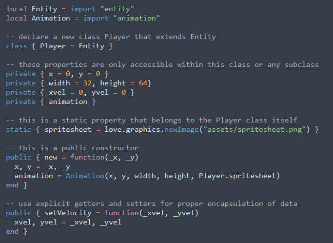
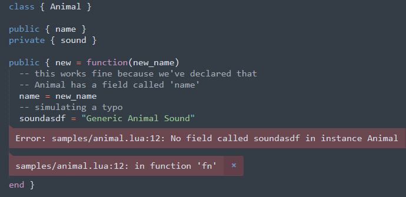
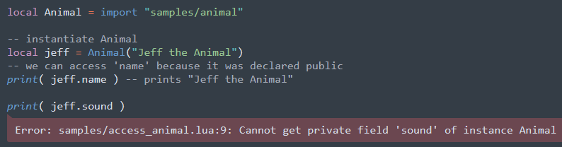

# Calcifer

*An OOP library for lua with proper information hiding that lets you write lua as if it were an Object-Oriented language like Java, C#, or Haxe*

Come take a look!



Yes, that's all vanilla lua. 

## No more accidental globals

Have you ever been annoyed by a hard-to-track bug in lua that was caused simply because you had a typo in your variable name?

Most of us have. And this is exacerbated in lua because it does not warn you if you type in a wrong name. It will simply create a new global variable called whatever the typo was!

With **`Calcifer`**, that is a thing of the past. It's impossible to accidentally declare global variables from within a class! In fact, it will raise an error if you have not declared a variable before.



It's still possible to declare a global variable if you *need* to, but you have to use the following syntax

```lua
_G.myGlobal = 42
```

this way, any globals have to be deliberately declared.

## Proper access modifiers

Have you ever wished there was a proper way to properly hide private functions in lua? Are you sick of naming your variables `_myVar` and just pretending you can't access them? Are you sick of writing closures upon closures, and then not being able to access local variables from a subclass?

Well **`Calcifer`** will simply not allow you to access private members of a class unless it's from within a class or a subclass of it!



# Installation

"Installation" (if you can even call it that) is super simple.

All you need is the file `calcifer.lua` file included with this repository along with its `CALCIFER-LICENSE`file 

You need the license file for legal reasons. But don't worry! Calcifer is MIT-Licensed. You can basically do anything you want with the code for any purpose. Personal or Commercial. You just can't sue me if your computer inexplicably blows up while you're running your game and you need someone to blame, and you have to include the license in your game folder somewhere. That's all!

Copy and paste `calcifer.lua` and `CALCIFER-LICENSE` somewhere in your game directory. And then before you can load any classes, you have to write the following

```lua
local Calcifer = require "path/to/calcifer"
import = Calcifer.import
```

and that's it! We're basically declaring a global function called `import` for maximum convenience. 

You can now start writing calcifer classes and instantiating them like so:

```lua
local Animal = import "path/to/animal"
local instance = Animal()
```

And if you don't want to use the word `import`, you can use any word you want. You don't even need to declare `import` as a global. But then in every file where you need to import a class to instantiate or extend, you'd need to do the following

```lua
local SomeClass = require("path/to/calcifer").import("path/to/someclass")
```

# Usage

TODO